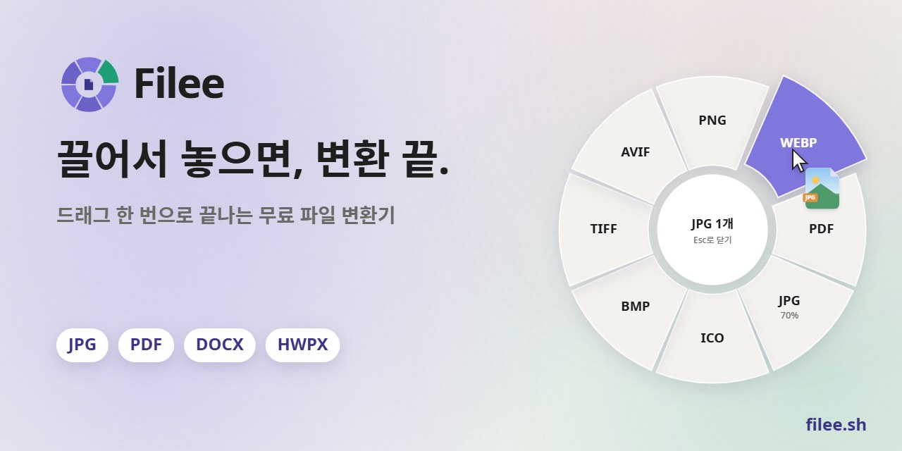
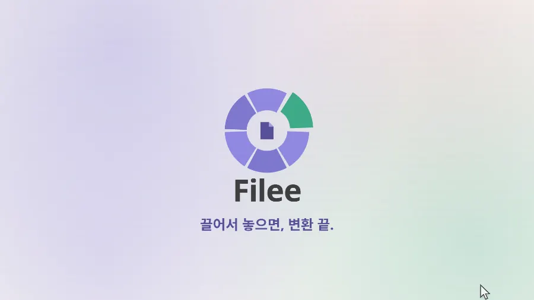
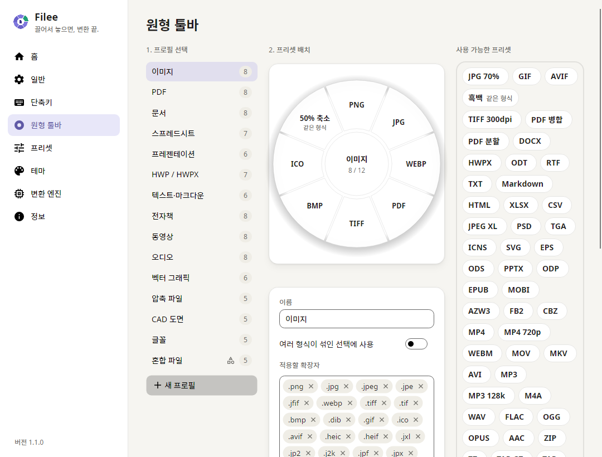
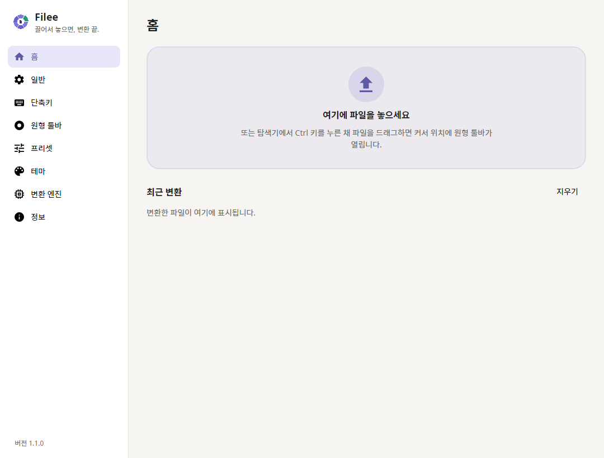
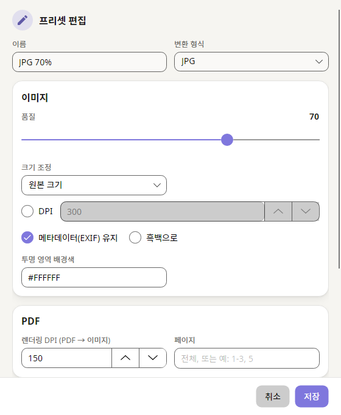
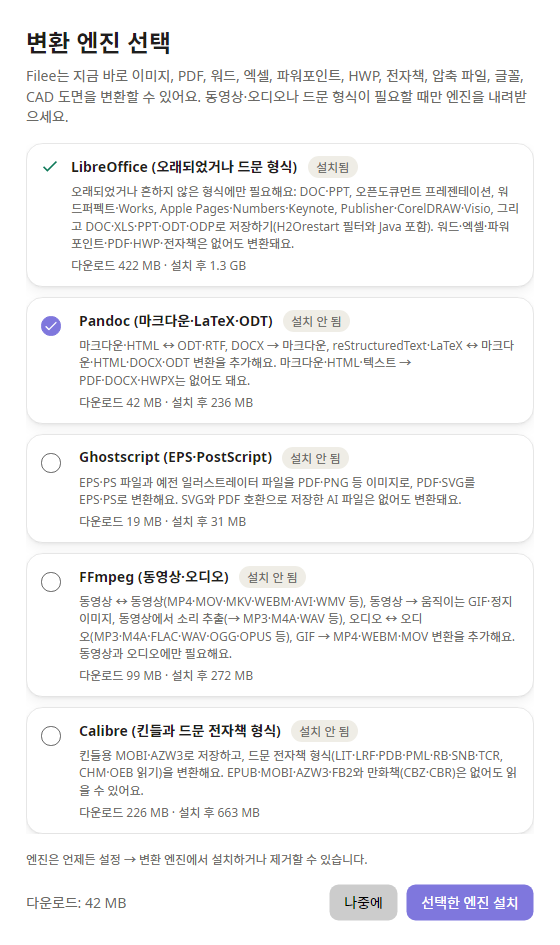

<p align="center">
  <a href="https://filee.sh/ko/"></a>
</p>

<p align="center">
  <b>드래그로 쓰는 무료 오픈소스 Windows 파일 변환기.</b><br>
  키(기본 <kbd>Ctrl</kbd>)를 누른 채 파일을 끌면 커서 위치에 도넛이 열립니다. 원하는 형식 위에 놓으면 끝.
</p>

<p align="center">
  <a href="https://filee.sh/ko/"><b>웹사이트</b></a> ·
  <a href="https://github.com/KnifeLemon/Filee/releases/latest"><b>다운로드</b></a> ·
  <a href="#시작하기">시작하기</a> ·
  <a href="#문서">문서</a>
</p>

<p align="center">
  <a href="https://github.com/KnifeLemon/Filee/actions/workflows/ci.yml"></a>
  <a href="https://github.com/KnifeLemon/Filee/releases/latest"></a>
  <a href="https://github.com/KnifeLemon/Filee/releases"></a>
  
  <a href="LICENSE"></a>
</p>

<p align="center"><a href="README.md">English</a> · <b>한국어</b> · <a href="README.zh-CN.md">简体中文</a></p>

<table>
  <tr>
    <td width="33%" valign="top"><b>커서 바로 옆에서</b><br>앱 창을 열 필요가 없어요. 끌고 있는 파일에 맞는 형식만 지금 있는 자리에 나타나요.</td>
    <td width="33%" valign="top"><b>170가지 넘는 형식, 다른 프로그램 없이</b><br>이미지, PDF, 워드, 엑셀, 파워포인트, HWP, 전자책, 압축 파일, 글꼴, CAD를 오피스·한컴오피스·LibreOffice 없이 변환해요.</td>
    <td width="33%" valign="top"><b>내 PC 안에서만</b><br>아무것도 업로드하지 않아요. 오프라인으로 동작하고 결과는 원본 바로 옆에 저장해요.</td>
  </tr>
</table>

## 이렇게 동작해요

<p align="center">
  <a href="https://filee.sh/ko/"></a><br>
  <sub>27초 영상과 직접 해보는 데모는 <a href="https://filee.sh/ko/">filee.sh</a>에서</sub>
</p>

## 기능

- **커서 위치에 뜨는 도넛 툴바.** 수정키(기본 <kbd>Ctrl</kbd>)를 누른 채 파일을 끌면 돼요. 수정키 조합, 마우스 버튼, 드래그
  거리, 길게 누르기, 선택한 파일용 키보드 단축키까지 모두 바꿀 수 있어요.
- **파일 종류별 툴바.** 이미지, PDF, 문서, 스프레드시트, 프레젠테이션, HWP, 텍스트, 전자책, 동영상, 오디오, 벡터 그래픽,
  압축 파일, CAD, 글꼴, 그리고 여러 종류를 함께 골랐을 때의 툴바. 실제 도넛 위에서 드래그 앤 드롭으로 프리셋을 배치하고,
  확장자는 태그로 추가하고, 우클릭이나 ✎로 프리셋을 편집해요.
- **프리셋.** 품질, 크기 조정, DPI, 메타데이터, PDF 합치기·나누기, 페이지 범위, 동영상 화질·해상도, 오디오 비트레이트,
  압축 수준, 저장 위치, 파일 이름 패턴, 이름 충돌 처리.
- **일괄 변환.** 1개든 100개든 동시에 변환하고, 하나가 실패해도 나머지는 계속돼요. "ZIP 하나로"는 어떤 파일이든 압축 파일
  하나로, "PDF 병합"은 PDF 하나로 묶어요.
- **경로 자동 계획.** 여러 단계 변환도 알아서 찾아요(예: HWP → HWPX → DOCX, EPUB → HWPX → PDF → PNG). 단계마다 가장 잘하는
  엔진을 써요.
- **네 가지 사용 방법.** 드래그 동작, 탐색기 우클릭 메뉴(Windows 11은 기본 메뉴에도)와 보내기, 탐색기에서 선택한 파일 +
  단축키, 메인 창 드롭 영역.
- **보이는 엔진.** 설정 → 변환 엔진에서 엔진마다 버전과 변환 범위를 보여 주고, 추가 엔진은 다운로드 속도와 남은 시간을
  보며 받을 수 있어요.
- **말랑한 애니메이션 UI.** 라이트·다크·시스템 테마, 강조색, 모서리 둥글기, 저사양 PC를 위한 *애니메이션 줄이기*.
- **한국어, English, 简体中文.** 기본값은 Windows 언어를 따라요.

## 지원 형식

| 원본 | 변환 대상 |
|---|---|
| **이미지**: JPG, PNG, WEBP, AVIF, TIFF, BMP, GIF, ICO, ICNS, JPEG XL, JPEG 2000, PSD/PSB, TGA, PPM; HEIC, GIMP XCF, 카메라 RAW(CR2, CR3, NEF, ARW, DNG 등)는 읽기 | 위 형식끼리, PDF, 크기 조정, 흑백 |
| **벡터**: SVG, SVGZ, EMF, WMF, AI · EPS, PS¹ · CDR, VSD, CGM, ODG² | PDF(벡터), PNG 등 이미지, SVG ↔ SVGZ, PDF → EPS/PS¹ |
| **PDF** | DOCX, HWPX, TXT, PNG, JPG, TIFF, CBZ; 합치기, 나누기, 페이지 범위 |
| **문서**: DOCX, DOCM, DOTX, EML · DOC, ODT, RTF, WPS, WPD, Pages 등² | PDF, DOCX, HWPX, EPUB, TXT, HTML |
| **스프레드시트**: XLSX, XLSM, XLS, ODS, CSV, TSV · Numbers, ET² | PDF, XLSX, ODS, CSV, TSV, HWPX, HTML |
| **프레젠테이션**: PPTX, PPTM, POTX, PPSX · PPT, ODP, Keynote² | PDF, PNG, JPG, DOCX, HWPX |
| **한글**: HWP, HWPX | PDF, PNG, DOCX, HWPX ↔ HWP, TXT, 마크다운, HTML |
| **텍스트**: TXT, 마크다운, HTML · reStructuredText, LaTeX³ | PDF, DOCX, HWPX, EPUB |
| **전자책**: EPUB, MOBI, AZW3, AZW, AZW4, FB2, CBZ, CBR, CB7, HTMLZ, TXTZ · LIT, LRF, CHM, PDB 등⁴ | PDF, EPUB, DOCX, TXT, HTML, HWPX · MOBI, AZW3⁴ |
| **동영상**⁵: MP4, MOV, MKV, WEBM, AVI, WMV, FLV, MPEG, TS, M2TS, 3GP, OGV, VOB 등 | MP4, WEBM, MOV, MKV, AVI, GIF, MP3, M4A, 720p |
| **오디오**⁵: MP3, M4A, AAC, WAV, FLAC, OGG, OPUS, WMA, AIFF, AMR 등 | MP3, M4A, WAV, FLAC, OGG, OPUS, AAC |
| **압축 파일**: ZIP, 7Z, RAR, TAR, TAR.GZ, TAR.BZ2, TAR.XZ, GZ, ISO, CAB, DMG, ALZ, EGG 등 | 압축 풀기, ZIP, 7Z, TAR, TAR.GZ; 여러 파일 → ZIP 하나 |
| **CAD**: DWG, DXF | PDF, SVG, PNG, DWG ↔ DXF |
| **글꼴**: TTF, OTF, WOFF, WOFF2, EOT | 서로 변환 |

표시가 없는 것은 설치하자마자 변환돼요. MS 오피스·한컴오피스·LibreOffice가 없어도 되고, PC에 설치된 프로그램은 쓰지 않아요.
처음 실행할 때 받을지 물어보는 추가 엔진: ¹ Ghostscript, ² LibreOffice, ³ Pandoc, ⁴ calibre, ⁵ FFmpeg. 엔진마다 무엇을
유지하고 무엇을 빼는지는 [docs/ENGINES.md](docs/ENGINES.md)에 있어요.

## 스크린샷

<table>
  <tr>
    <td width="50%"></td>
    <td width="50%"></td>
  </tr>
  <tr>
    <td align="center"><sub>파일 종류마다 도넛을 드래그 앤 드롭으로 배치</sub></td>
    <td align="center"><sub>홈: 드롭 영역과 최근 변환 기록</sub></td>
  </tr>
  <tr>
    <td width="50%" align="center"></td>
    <td width="50%" align="center"></td>
  </tr>
  <tr>
    <td align="center"><sub>프리셋 편집: 품질, 크기, 저장 위치, 파일 이름</sub></td>
    <td align="center"><sub>큰 엔진은 처음 실행할 때 골라서 설치</sub></td>
  </tr>
</table>

## 시작하기

**설치:** [Releases](https://github.com/KnifeLemon/Filee/releases/latest)에서 최신 `Filee-<버전>-win-Setup.exe`를
받으세요(Windows 10/11, 64비트).

- **설치 파일은 가벼워요.** 이미지, PDF, 워드, 엑셀, 파워포인트, HWP, 전자책, 압축 파일, 글꼴, CAD는 설치하자마자 변환돼요.
- **큰 엔진은 골라서 설치해요.** 처음 실행하면 동영상·오디오용 엔진(FFmpeg, 약 100MB)과 드문 형식용 엔진(LibreOffice,
  calibre, Ghostscript, Pandoc)을 크기와 함께 보여 줘요. 설정 → 변환 엔진에서 다운로드 속도와 남은 시간을 보며 언제든
  설치하거나 지울 수 있어요.
- **업데이트는 알려 드려요.** 새 버전이 나오면 메뉴 하단, 알림, 트레이 메뉴에 표시되고 누르면 최신 릴리스 페이지가
  열려요. 새 설치 파일을 실행하면 설정은 그대로 유지돼요.

macOS 지원은 계획 중입니다.

<details>
<summary><b>소스에서 빌드</b></summary>

필요: .NET 10 SDK, Windows 10/11.

```bash
git clone https://github.com/KnifeLemon/Filee.git
cd Filee
pwsh build/fetch-fonts.ps1                       # 선택: Noto Sans 글꼴
pwsh build/fetch-engines.ps1 -Only rhwp,pandoc   # 선택: 개발용 엔진 (전체는 -Only 생략, 약 475MB)
dotnet run --project src/Filee.App
dotnet test
```

설정은 `%APPDATA%\Filee`에 저장됩니다. 디버그 빌드는 탐색기 우클릭 메뉴나 자동 시작을 건드리지 않습니다.

| 프로젝트 | 설명 |
|---|---|
| `src/Filee.Core` | 형식, 프리셋, 툴바 프로필, 설정, 경로 계획, 작업 큐. UI·OS API 없음. |
| `src/Filee.Engines` | 변환 엔진마다 클래스 하나(`IConverter`). HWPX 작성기 포함. |
| `src/Filee.Platform.Windows` | 탐색기 연동, 우클릭 메뉴, 자동 시작. |
| `src/Filee.App` | Avalonia UI: 도넛 툴바, 설정 창, 트레이, 알림. |
| `tests/*` | xUnit v3 테스트(헤드리스 UI 렌더링 포함). |

</details>

## 문서

| 하고 싶은 일 | 여기서 시작 |
|---|---|
| 앱 구조 이해하기 | [docs/ARCHITECTURE.md](docs/ARCHITECTURE.md) |
| 어떤 엔진이 무엇을 변환하는지, 라이선스 | [docs/ENGINES.md](docs/ENGINES.md) |
| 새 변환 추가하기 | [docs/ADDING-A-CONVERTER.md](docs/ADDING-A-CONVERTER.md) |
| 새 언어로 번역하기 | [docs/ADDING-A-LANGUAGE.md](docs/ADDING-A-LANGUAGE.md) |
| PR 보내기 | [CONTRIBUTING.md](CONTRIBUTING.md) |

## 기여

PR 환영합니다. 시작하기 좋은 작업은 [변환기 추가](docs/ADDING-A-CONVERTER.md)와 [언어 추가](docs/ADDING-A-LANGUAGE.md)입니다.
Filee가 쓸만하다면 ⭐ 하나가 다른 사람들이 찾는 데 큰 도움이 됩니다.

## 라이선스

MIT. 포함된 서드파티 구성요소는 각자의 라이선스를 따릅니다: [THIRD-PARTY-NOTICES.md](THIRD-PARTY-NOTICES.md).

<p align="center">
  <a href="https://star-history.com/#KnifeLemon/Filee&Date"></a>
</p>
