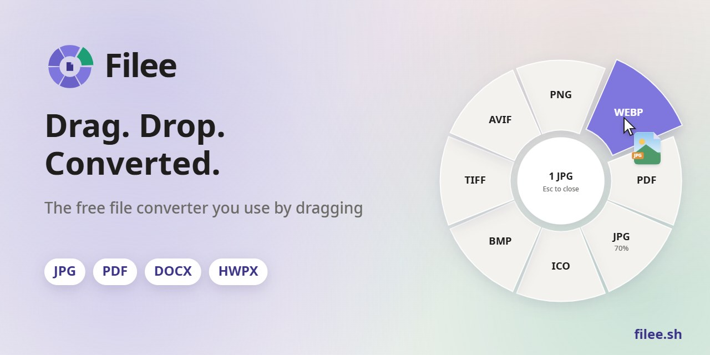
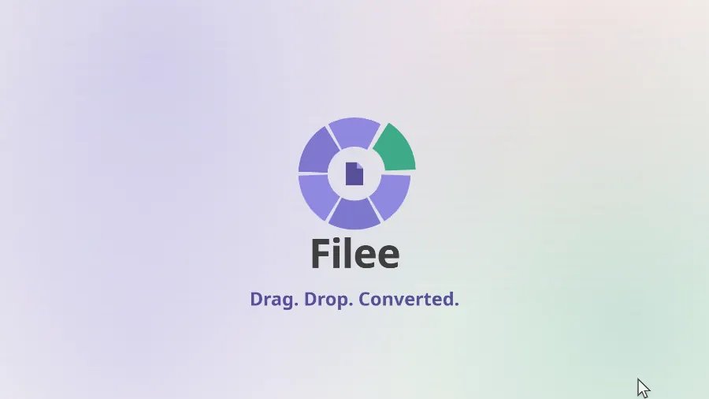
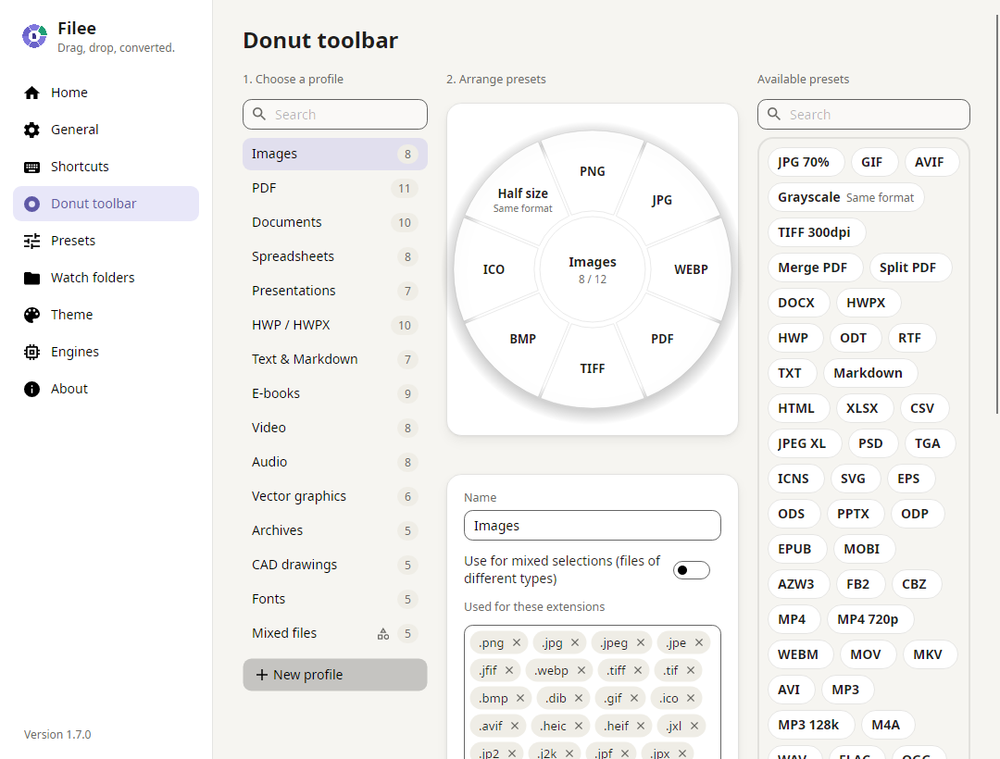
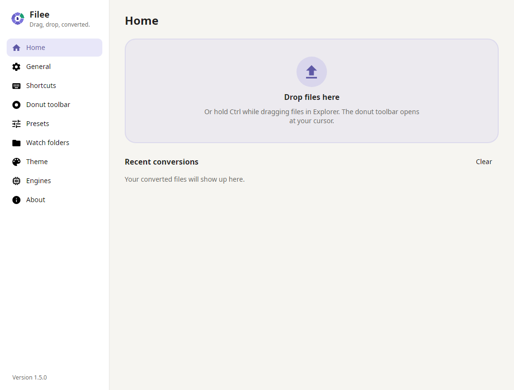
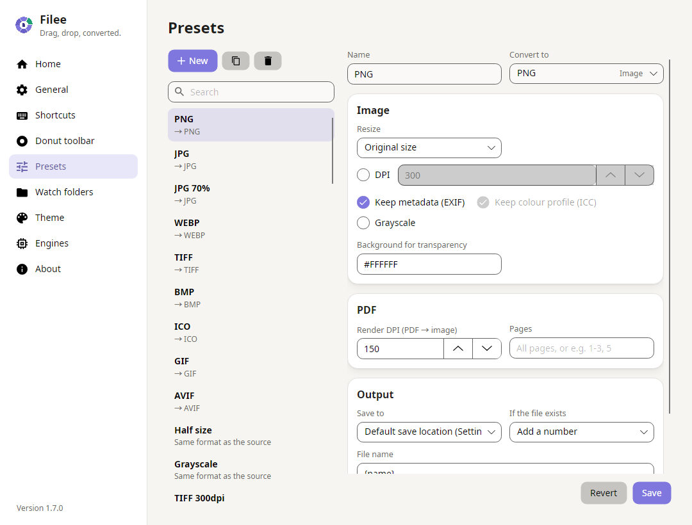
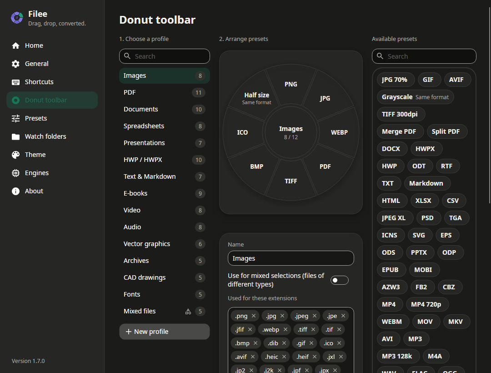

<p align="center">
  <a href="https://filee.sh"></a>
</p>

<p align="center">
  <b>A free, open-source file converter for Windows that you use by dragging.</b><br>
  Hold a key (<kbd>Ctrl</kbd> by default), drag files and drop them on a format in the donut that opens right at your cursor.
</p>

<p align="center">
  <a href="https://filee.sh"><b>Website</b></a> ·
  <a href="https://github.com/KnifeLemon/Filee/releases/latest"><b>Download</b></a> ·
  <a href="#install">Install</a> ·
  <a href="#command-line">Command line</a> ·
  <a href="#documentation">Docs</a>
</p>

<p align="center">
  <a href="https://github.com/KnifeLemon/Filee/actions/workflows/ci.yml"></a>
  <a href="https://github.com/KnifeLemon/Filee/releases/latest"></a>
  <a href="https://github.com/KnifeLemon/Filee/releases"></a>
  
  <a href="LICENSE"></a>
</p>

<p align="center"><b>English</b> · <a href="README.ko.md">한국어</a> · <a href="README.zh-CN.md">简体中文</a></p>

<table>
  <tr>
    <td width="33%" valign="top"><b>Right at your cursor</b><br>No app window to open. The formats appear where you already are, only the ones that make sense for the files you drag.</td>
    <td width="33%" valign="top"><b>180 formats, no other software</b><br>Images, PDF, Word, Excel, PowerPoint, HWP, e-books, archives, fonts and CAD work without Office, Hancom Office or LibreOffice.</td>
    <td width="33%" valign="top"><b>Stays on your PC</b><br>Nothing is uploaded. Filee works offline and saves the result right next to the original.</td>
  </tr>
</table>

## See it in action

<p align="center">
  <a href="https://filee.sh"></a><br>
  <sub>Watch the 27-second video and try the interactive demo on <a href="https://filee.sh">filee.sh</a></sub>
</p>

## Install

Download the latest `Filee-<version>-win-Setup.exe` from
[Releases](https://github.com/KnifeLemon/Filee/releases/latest) (Windows 10/11, 64-bit) and run it. Setup asks for
administrator rights once and installs Filee for all users in Program Files. Prefer no installer? Unzip
`Filee-<version>-win-Portable.zip` anywhere and run `Filee.exe`.

- **Everything common is in the installer.** Images, PDF, Word, Excel, PowerPoint, HWP, e-books, archives, fonts and
  CAD work right away.
- **Choose in Setup.** Add “Convert with Filee” to the File Explorer menu (on Windows 11 also at the top of the menu,
  not only under “Show more options”), start Filee when you sign in, and pick optional engines: video and audio
  (FFmpeg, ~100 MB) and rare formats (LibreOffice, calibre, Ghostscript, Pandoc), each with its size. Filee downloads
  the chosen engines when Setup starts it; install or remove them any time in Settings → Engines, which shows download
  speed and time left.
- **Updates install themselves.** When a new release is out, Filee says so at the bottom of the menu, in a notice and
  in the tray menu. Press Update and Filee downloads the new installer, checks it against the release's SHA-256 file
  and runs it after one administrator prompt. Setup closes Filee, updates it, keeps your settings and engines, and
  starts it again. The portable copy opens the release page instead. Filee 1.1 and earlier (installed per user) are
  taken over by the new installer too.

Linux and macOS ports are in development. Native desktop validation is still in progress; the Windows release
remains the stable download. See [the Unix build instructions](CONTRIBUTING.md#linux-and-macos-development).

## Features

- **Donut toolbar at the cursor.** Hold a modifier key (<kbd>Ctrl</kbd> by default) and drag files. Everything is
  configurable: any modifier combination, mouse button, drag distance, a hold gesture or a keyboard shortcut for the
  selected files.
- **One toolbar per file type.** Images, PDF, documents, spreadsheets, presentations, HWP, text, e-books, video, audio,
  vector graphics, archives, CAD and fonts, plus toolbars for mixed selections. Arrange presets on a live donut (it opens a gap where a dragged preset will land) by
  drag & drop, add extensions as tags, right-click or ✎ to edit a preset.
- **Presets.** Quality, resizing, DPI, metadata, PDF merge and split, page ranges, video quality and resolution, audio
  bitrate, archive compression, output folder, file name pattern, conflict handling and keeping the original file dates
  (one preset at a time, or for every conversion in Settings → General). TIFF presets can put every file into one
  multi-page TIFF (one page per image or PDF page).
  Converted files go next to the original by default. Settings → General sets another default save location (a
  subfolder or one fixed folder) for every preset that has no location of its own.
- **Batch conversion.** 1 file or 100, converted in parallel; one failure never stops the rest. "One ZIP" packs any
  files into a single archive, "Merge PDF" makes one PDF.
- **Planned routes.** Multi-step conversions are found automatically (e.g. HWP → HWPX → DOCX, EPUB → HWPX → PDF → PNG),
  each step with the engine that does it best.
- **Four ways in.** The drag gesture, Explorer's right-click menu (on Windows 11 also in the main menu) and Send To, a
  keyboard shortcut on the Explorer selection, and the drop zone in the main window.
- **Watch folders.** Files that land in a folder you choose are converted automatically while Filee runs, once
  downloads and copies are complete. Keep the originals or move them aside so the folder works like an inbox.
- **Command line.** `filee convert *.heic --to jpg`, `filee watch D:\Inbox --to pdf`, with your presets, JSON output
  for scripts and exit codes. Setup can put the `filee` command on PATH.
- **Engines you can see.** Settings → Engines lists every engine with its version and what it converts; optional
  engines download with speed and time left. FFmpeg, calibre, Pandoc, Ghostscript or LibreOffice already on your PC
  (on the PATH, Scoop included, or in Program Files) are found and used instead of a download, with a note when one is
  older than the version Filee is tested with. "Use my copy…" picks a specific one.
- **Soft, animated UI.** Light, dark or system theme, your accent colour, adjustable roundness and a *Reduce animations*
  switch for older PCs.
- **English, 한국어, 简体中文**, following your Windows language by default.

## Formats

| From | To |
|---|---|
| **Images**: JPG, PNG, WEBP, AVIF, TIFF, BMP, GIF, ICO, ICNS, JPEG XL, JPEG 2000, PSD/PSB, TGA, PPM; HEIC, GIMP XCF, camera RAW (CR2, CR3, NEF, ARW, DNG, …) read | any of these, PDF, resized, grayscale |
| **Vector**: SVG, SVGZ, EMF, WMF, AI · EPS, PS¹ · CDR, VSD, CGM, ODG² | PDF (vector), PNG and other images, SVG ↔ SVGZ, PDF → EPS/PS¹ |
| **PDF** | DOCX, HWPX, TXT, PNG, JPG, TIFF, CBZ; merge, split, page ranges |
| **Documents**: DOCX, DOCM, DOTX, EML · DOC, ODT, RTF, WPS, WPD, Pages, …² | PDF, DOCX, HWPX, EPUB, TXT, HTML |
| **Spreadsheets**: XLSX, XLSM, XLS, ODS, CSV, TSV · Numbers, ET² | PDF, XLSX, ODS, CSV, TSV, HWPX, HTML |
| **Presentations**: PPTX, PPTM, POTX, PPSX · PPT, ODP, Keynote² | PDF, PNG, JPG, DOCX, HWPX |
| **HWP**: HWP, HWPX | PDF, PNG, DOCX, HWPX ↔ HWP, TXT, Markdown, HTML |
| **Text**: TXT, Markdown, HTML · reStructuredText, LaTeX³ | PDF, DOCX, HWPX, EPUB |
| **E-books**: EPUB, MOBI, AZW3, AZW, AZW4, FB2, CBZ, CBR, CB7, HTMLZ, TXTZ · LIT, LRF, CHM, PDB, …⁴ | PDF, EPUB, DOCX, TXT, HTML, HWPX · MOBI, AZW3⁴ |
| **Video**⁵: MP4, MOV, MKV, WEBM, AVI, WMV, FLV, MPEG, TS, M2TS, 3GP, OGV, VOB, … | MP4, WEBM, MOV, MKV, AVI, GIF, MP3, M4A, 720p |
| **Audio**⁵: MP3, M4A, AAC, WAV, FLAC, OGG, OPUS, WMA, AIFF, AMR, … | MP3, M4A, WAV, FLAC, OGG, OPUS, AAC |
| **Archives**: ZIP, 7Z, RAR, TAR, TAR.GZ, TAR.BZ2, TAR.XZ, GZ, ISO, CAB, DMG, ALZ, EGG, … | extract, ZIP, 7Z, TAR, TAR.GZ; any files → one ZIP |
| **CAD**: DWG, DXF | PDF, SVG, PNG, DWG ↔ DXF |
| **Fonts**: TTF, OTF, WOFF, WOFF2, EOT | each other |

Everything without a mark works out of the box: no Microsoft Office, Hancom Office or LibreOffice needed, and Filee
doesn't use Microsoft Office or Hancom Office even when they are installed. The optional engines below are
downloaded only if your PC doesn't already have them. Optional engines Filee offers to download: ¹ Ghostscript, ² LibreOffice,
³ Pandoc, ⁴ calibre, ⁵ FFmpeg. Details, including what each engine keeps and leaves out:
[docs/ENGINES.md](docs/ENGINES.md).

## Command line

The `filee` command converts files and watches folders without opening the app, with the same engines and presets.
Tick **Add the "filee" command to PATH** in Setup, then open a new terminal.

```
filee convert photo.heic --to jpg
filee convert *.png --to webp --quality 80 -o converted
filee convert D:\Scans --recursive --preset to-pdf --json
filee watch D:\Inbox --to pdf --move-originals
filee formats heic
filee presets
```

| Command | What it does |
|---|---|
| `filee convert` | Converts files, wildcards (`*.heic`) and folders with `--to <format>` or `--preset <preset>` |
| `filee watch` | Converts files that land in a folder until <kbd>Ctrl</kbd>+<kbd>C</kbd> |
| `filee formats` | Lists every format, or what one format converts to |
| `filee presets` | Lists the presets saved in the app |

`--json` prints the result for scripts and other programs. Exit codes: `0` all converted, `1` some files failed,
`2` wrong arguments or a missing input, `3` nothing to convert. Every option is in the
[command line guide](https://filee.sh/cli/) and in `filee help`.

## Screenshots

<table>
  <tr>
    <td width="50%"></td>
    <td width="50%"></td>
  </tr>
  <tr>
    <td align="center"><sub>Arrange the donut by drag & drop, one profile per file type</sub></td>
    <td align="center"><sub>Home: drop zone and recent conversions</sub></td>
  </tr>
  <tr>
    <td width="50%"></td>
    <td width="50%"></td>
  </tr>
  <tr>
    <td align="center"><sub>Presets: quality, size, PDF pages, output folder and file names</sub></td>
    <td align="center"><sub>Dark theme</sub></td>
  </tr>
</table>

## Documentation

| I want to… | Start here |
|---|---|
| Use the command line | [filee.sh/cli](https://filee.sh/cli/) |
| Understand how the app fits together | [docs/ARCHITECTURE.md](docs/ARCHITECTURE.md) |
| Know which engine converts what, and their licenses | [docs/ENGINES.md](docs/ENGINES.md) |
| Add a new conversion | [docs/ADDING-A-CONVERTER.md](docs/ADDING-A-CONVERTER.md) |
| Translate Filee into my language | [docs/ADDING-A-LANGUAGE.md](docs/ADDING-A-LANGUAGE.md) |
| Send a pull request | [CONTRIBUTING.md](CONTRIBUTING.md) |

## Build from source

Requirements: .NET 10 SDK, Windows 10/11.

```bash
git clone https://github.com/KnifeLemon/Filee.git
cd Filee
pwsh build/fetch-fonts.ps1                       # optional: Noto Sans UI fonts
pwsh build/fetch-engines.ps1 -Only rhwp,pandoc   # optional engines for development (all: omit -Only, ~475 MB)
dotnet run --project src/Filee.App
dotnet test
```

Settings live in `%APPDATA%\Filee`. Builds from source never touch the Explorer context menu or auto-start.
`pwsh build/build-installer.ps1` publishes Filee and builds the installer into `Releases/` (it downloads a pinned,
portable Inno Setup into `build/.cache`; nothing is installed).

| Project | What it is |
|---|---|
| `src/Filee.Core` | Formats, presets, toolbar profiles, settings, route planner, job queue. No UI, no OS APIs. |
| `src/Filee.Engines` | One class per conversion engine (`IConverter`), including the HWPX writer. |
| `src/Filee.Platform.Windows` | Explorer integration, context menu, auto-start. |
| `src/Filee.App` | Avalonia UI: donut toolbar, settings window, tray, toasts. |
| `src/Filee.Cli` | The `filee` command line (convert, watch, formats, presets) on the same engines and presets. |
| `tests/*` | xUnit v3 tests, including headless UI rendering. |

## Contributing

Pull requests are welcome. Good first steps are [adding a converter](docs/ADDING-A-CONVERTER.md) and
[adding a language](docs/ADDING-A-LANGUAGE.md). If Filee saves you some clicks, a ⭐ helps other people find it.

## Code signing policy

Free code signing provided by [SignPath.io](https://about.signpath.io/), certificate by
[SignPath Foundation](https://signpath.org/).

> Filee has applied for this program. Until it is approved, releases are not code-signed and Windows SmartScreen may
> warn when you run the installer ("More info" → "Run anyway").

- Committers and reviewers: [KnifeLemon](https://github.com/KnifeLemon)
- Approvers: [KnifeLemon](https://github.com/KnifeLemon)

Only the installer and files built by this repository's GitHub Actions release workflow are signed, and every release
is approved by hand. Bundled third-party programs (rhwp, 7-Zip) keep their own publishers' files.

### Privacy policy

Filee converts files on your own computer and never uploads them. It collects no usage data and sends no telemetry.
It connects to the internet only:

- to ask GitHub (`api.github.com`) whether a newer release exists, shortly after start and then every few hours.
  Turn this off in Settings → General ("Check for updates").
- to download the conversion engines you choose to install, from the official locations pinned in
  [`engines.json`](src/Filee.Engines/Infrastructure/engines.json).
- when you click a link, which opens your web browser.

## License

MIT. Bundled third-party components keep their own licenses: see [THIRD-PARTY-NOTICES.md](THIRD-PARTY-NOTICES.md).

<p align="center">
  <a href="https://star-history.com/#KnifeLemon/Filee&Date"></a>
</p>
