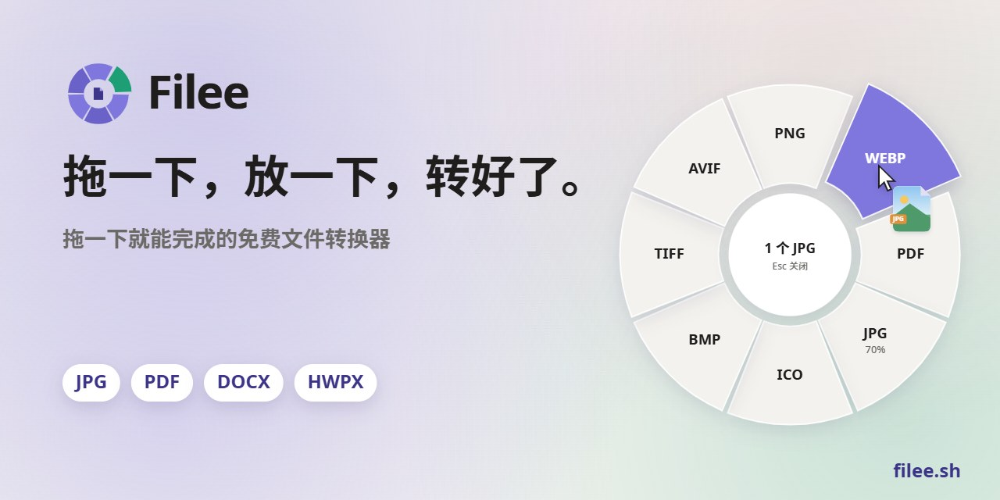
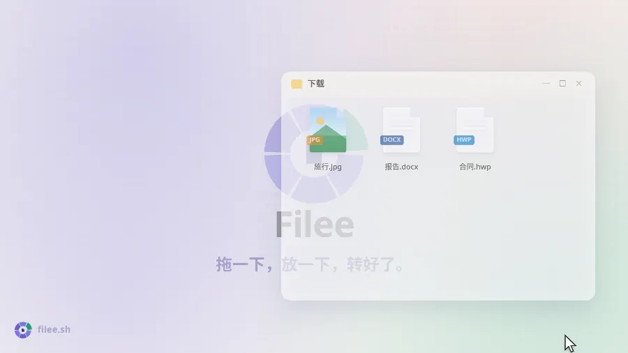
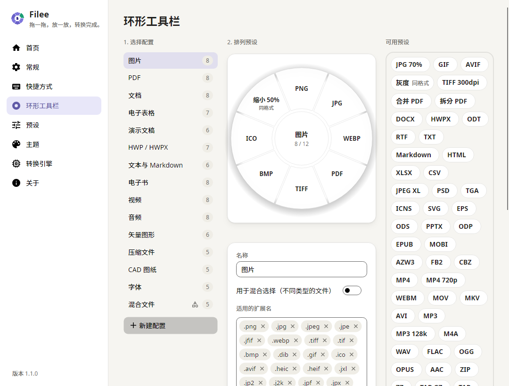
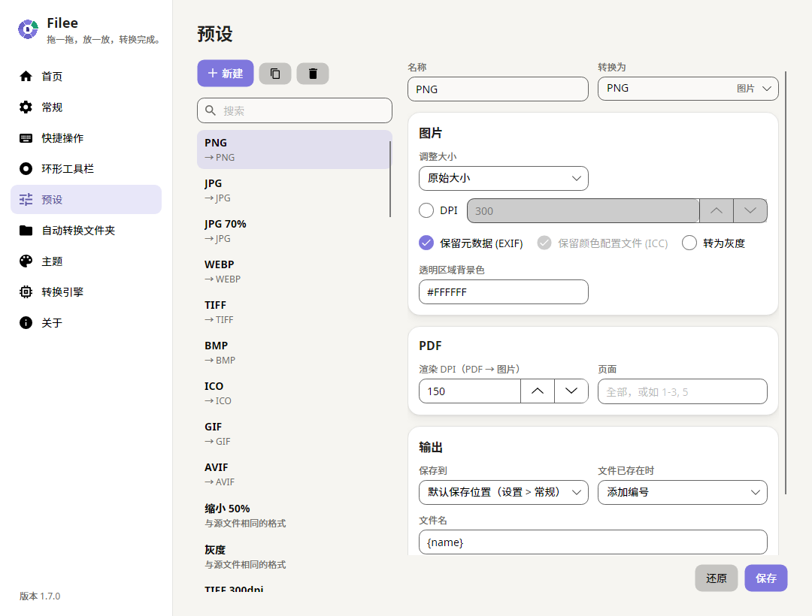

<p align="center">
  <a href="https://filee.sh/zh-cn/"></a>
</p>

<p align="center">
  <b>用拖放操作的免费开源 Windows 文件格式转换器。</b><br>
  按住一个键（默认 <kbd>Ctrl</kbd>）拖动文件，光标处会弹出格式圆环，放到想要的格式上即可。
</p>

<p align="center">
  <a href="https://filee.sh/zh-cn/"><b>官网</b></a> ·
  <a href="https://github.com/KnifeLemon/Filee/releases/latest"><b>下载</b></a> ·
  <a href="#快速开始">快速开始</a> ·
  <a href="#文档">文档</a>
</p>

<p align="center">
  <a href="https://github.com/KnifeLemon/Filee/actions/workflows/ci.yml"></a>
  <a href="https://github.com/KnifeLemon/Filee/releases/latest"></a>
  <a href="https://github.com/KnifeLemon/Filee/releases"></a>
  
  <a href="LICENSE"></a>
</p>

<p align="center"><a href="README.md">English</a> · <a href="README.ko.md">한국어</a> · <b>简体中文</b></p>

<table>
  <tr>
    <td width="33%" valign="top"><b>就在光标旁</b><br>无需打开应用窗口。只显示适合当前拖动文件的格式，就在你所在的位置。</td>
    <td width="33%" valign="top"><b>170 多种格式，无需其他软件</b><br>图片、PDF、Word、Excel、PowerPoint、HWP、电子书、压缩包、字体和 CAD，无需 Office、韩文办公软件或 LibreOffice。</td>
    <td width="33%" valign="top"><b>只在你的电脑上</b><br>不上传任何文件。Filee 离线工作，结果保存在原文件旁边。</td>
  </tr>
</table>

## 实际效果

<p align="center">
  <a href="https://filee.sh/zh-cn/"></a><br>
  <sub>27 秒视频和可交互演示请访问 <a href="https://filee.sh/zh-cn/">filee.sh</a></sub>
</p>

## 功能

- **光标处的格式圆环。** 按住修饰键（默认 <kbd>Ctrl</kbd>）拖动文件即可。修饰键组合、鼠标按键、拖动距离、长按手势，
  以及对选中文件使用的快捷键都可以自定义。
- **按文件类型的工具栏。** 图片、PDF、文档、表格、演示文稿、HWP、文本、电子书、视频、音频、矢量图、压缩包、CAD 和字体，
  以及用于混合选择的工具栏。直接在圆环上拖放来排列预设，以标签方式添加扩展名，右键或 ✎ 编辑预设。
- **预设。** 质量、缩放、DPI、元数据、PDF 合并与拆分、页码范围、视频画质与分辨率、音频码率、压缩级别、保存位置、
  文件名模板和重名处理。
- **批量转换。** 1 个或 100 个文件并行转换，某个文件失败也不影响其余文件。"打包成一个 ZIP"可把任意文件压缩为一个压缩包，
  "合并 PDF"生成一个 PDF。
- **自动规划路径。** 自动找到多步转换路径（例如 HWP → HWPX → DOCX、EPUB → HWPX → PDF → PNG），每一步使用最擅长的引擎。
- **四种使用方式。** 拖动手势、资源管理器右键菜单（Windows 11 也可加入主菜单）和“发送到”、对资源管理器中选中的文件按
  快捷键、主窗口拖放区。
- **引擎一目了然。** “设置 → 转换引擎”列出每个引擎的版本和可转换内容；可选引擎下载时显示速度和剩余时间。
- **柔和的动画界面。** 浅色、深色或跟随系统，自定义强调色和圆角，旧电脑可开启“减少动画”。
- **简体中文、English、한국어**，默认跟随 Windows 语言。

## 支持格式

| 源格式 | 目标格式 |
|---|---|
| **图片**：JPG、PNG、WEBP、AVIF、TIFF、BMP、GIF、ICO、ICNS、JPEG XL、JPEG 2000、PSD/PSB、TGA、PPM；HEIC、GIMP XCF、相机 RAW（CR2、CR3、NEF、ARW、DNG 等）仅读取 | 上述格式互转、PDF、缩放、灰度 |
| **矢量图**：SVG、SVGZ、EMF、WMF、AI · EPS、PS¹ · CDR、VSD、CGM、ODG² | PDF（矢量）、PNG 等图片、SVG ↔ SVGZ、PDF → EPS/PS¹ |
| **PDF** | DOCX、HWPX、TXT、PNG、JPG、TIFF、CBZ；合并、拆分、页码范围 |
| **文档**：DOCX、DOCM、DOTX、EML · DOC、ODT、RTF、WPS、WPD、Pages 等² | PDF、DOCX、HWPX、EPUB、TXT、HTML |
| **表格**：XLSX、XLSM、XLS、ODS、CSV、TSV · Numbers、ET² | PDF、XLSX、ODS、CSV、TSV、HWPX、HTML |
| **演示文稿**：PPTX、PPTM、POTX、PPSX · PPT、ODP、Keynote² | PDF、PNG、JPG、DOCX、HWPX |
| **HWP**：HWP、HWPX | PDF、PNG、DOCX、HWPX ↔ HWP、TXT、Markdown、HTML |
| **文本**：TXT、Markdown、HTML · reStructuredText、LaTeX³ | PDF、DOCX、HWPX、EPUB |
| **电子书**：EPUB、MOBI、AZW3、AZW、AZW4、FB2、CBZ、CBR、CB7、HTMLZ、TXTZ · LIT、LRF、CHM、PDB 等⁴ | PDF、EPUB、DOCX、TXT、HTML、HWPX · MOBI、AZW3⁴ |
| **视频**⁵：MP4、MOV、MKV、WEBM、AVI、WMV、FLV、MPEG、TS、M2TS、3GP、OGV、VOB 等 | MP4、WEBM、MOV、MKV、AVI、GIF、MP3、M4A、720p |
| **音频**⁵：MP3、M4A、AAC、WAV、FLAC、OGG、OPUS、WMA、AIFF、AMR 等 | MP3、M4A、WAV、FLAC、OGG、OPUS、AAC |
| **压缩包**：ZIP、7Z、RAR、TAR、TAR.GZ、TAR.BZ2、TAR.XZ、GZ、ISO、CAB、DMG、ALZ、EGG 等 | 解压、ZIP、7Z、TAR、TAR.GZ；多个文件 → 一个 ZIP |
| **CAD**：DWG、DXF | PDF、SVG、PNG、DWG ↔ DXF |
| **字体**：TTF、OTF、WOFF、WOFF2、EOT | 互相转换 |

未标注的格式装好即用：无需 Microsoft Office、韩文办公软件或 LibreOffice，Filee 也从不调用电脑上已安装的程序。首次启动时
可选择下载的引擎：¹ Ghostscript、² LibreOffice、³ Pandoc、⁴ calibre、⁵ FFmpeg。各引擎保留和不支持的内容见
[docs/ENGINES.md](docs/ENGINES.md)。

## 截图

<table>
  <tr>
    <td width="50%"></td>
    <td width="50%"></td>
  </tr>
  <tr>
    <td align="center"><sub>拖放排列圆环，每种文件类型一个配置</sub></td>
    <td align="center"><sub>主页：拖放区和最近转换记录</sub></td>
  </tr>
  <tr>
    <td width="50%"></td>
    <td width="50%"></td>
  </tr>
  <tr>
    <td align="center"><sub>预设：质量、尺寸、PDF 页码、保存位置和文件名</sub></td>
    <td align="center"><sub>深色主题</sub></td>
  </tr>
</table>

## 快速开始

**安装：** 在 [Releases](https://github.com/KnifeLemon/Filee/releases/latest) 下载最新的
`Filee-<版本>-win-Setup.exe`（Windows 10/11，64 位）并运行。安装程序会请求一次管理员权限，为所有用户安装到
Program Files。不想安装？把 `Filee-<版本>-win-Portable.zip` 解压到任意位置，运行 `Filee.exe` 即可。

- **常用格式都已包含在安装包中。** 图片、PDF、Word、Excel、PowerPoint、HWP、电子书、压缩包、字体和 CAD 装好即用。
- **安装时即可选择。** 在资源管理器右键菜单中添加“用 Filee 转换”（Windows 11 上还可直接显示在主菜单，无需点
  “显示更多选项”）、登录时启动，并按大小挑选可选引擎：视频/音频（FFmpeg，约 100 MB）和少见格式（LibreOffice、
  calibre、Ghostscript、Pandoc）。所选引擎会在安装完成、Filee 启动后下载；之后可随时在“设置 → 转换引擎”中安装或
  删除，并显示下载速度和剩余时间。
- **有更新会提醒你。** 新版本发布后，Filee 会在菜单底部、通知和托盘菜单中提示，点击即可打开最新发布页面下载。
  运行新的安装程序会关闭 Filee 并完成更新，设置和引擎都会保留。按用户安装的 Filee 1.1 及更早版本也会以同样方式接管。

macOS 版本正在计划中。

<details>
<summary><b>从源码构建</b></summary>

需要：.NET 10 SDK、Windows 10/11。

```bash
git clone https://github.com/KnifeLemon/Filee.git
cd Filee
pwsh build/fetch-fonts.ps1                       # 可选：Noto Sans 字体
pwsh build/fetch-engines.ps1 -Only rhwp,pandoc   # 可选：开发用引擎（全部下载请省略 -Only，约 475 MB）
dotnet run --project src/Filee.App
dotnet test
```

设置保存在 `%APPDATA%\Filee`。调试版本不会修改资源管理器右键菜单和开机自启动。

| 项目 | 说明 |
|---|---|
| `src/Filee.Core` | 格式、预设、工具栏配置、设置、路径规划、任务队列。不依赖 UI 和系统 API。 |
| `src/Filee.Engines` | 每个转换引擎一个类（`IConverter`），包括 HWPX 写入器。 |
| `src/Filee.Platform.Windows` | 资源管理器集成、右键菜单、开机自启动。 |
| `src/Filee.App` | Avalonia 界面：圆环工具栏、设置窗口、托盘、通知。 |
| `tests/*` | xUnit v3 测试，包括无头 UI 渲染。 |

</details>

## 文档

| 我想要… | 从这里开始 |
|---|---|
| 了解应用的整体结构 | [docs/ARCHITECTURE.md](docs/ARCHITECTURE.md) |
| 了解各引擎负责哪些转换及其许可证 | [docs/ENGINES.md](docs/ENGINES.md) |
| 添加新的转换 | [docs/ADDING-A-CONVERTER.md](docs/ADDING-A-CONVERTER.md) |
| 把 Filee 翻译成我的语言 | [docs/ADDING-A-LANGUAGE.md](docs/ADDING-A-LANGUAGE.md) |
| 提交 Pull Request | [CONTRIBUTING.md](CONTRIBUTING.md) |

## 参与贡献

欢迎提交 Pull Request。适合入门的任务：[添加转换器](docs/ADDING-A-CONVERTER.md)和[添加语言](docs/ADDING-A-LANGUAGE.md)。
如果 Filee 帮你省了时间，点个 ⭐ 能让更多人发现它。

## 代码签名政策

Filee 的代码签名政策（Code signing policy）和隐私政策见[英文 README](README.md#code-signing-policy)。Filee 不会上传文件，
也不会发送任何使用数据。

## 许可证

MIT。随附的第三方组件遵循各自的许可证，详见 [THIRD-PARTY-NOTICES.md](THIRD-PARTY-NOTICES.md)。

<p align="center">
  <a href="https://star-history.com/#KnifeLemon/Filee&Date"></a>
</p>
